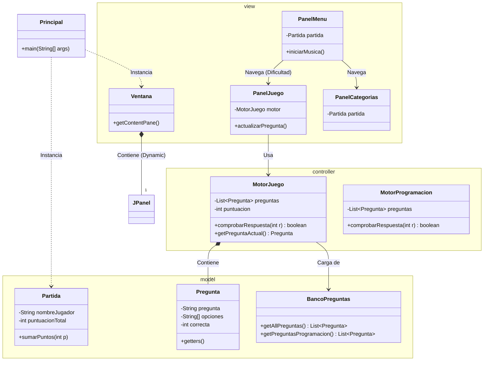

# DevQuiz: Edición DAW

## 🏗️ Arquitectura del Proyecto (Patrón MVC)

El juego está estructurado siguiendo el patrón **Modelo-Vista-Controlador (MVC)**, separando la lógica del juego de la interfaz gráfica para facilitar el mantenimiento y la expansión a nuevas asignaturas.

