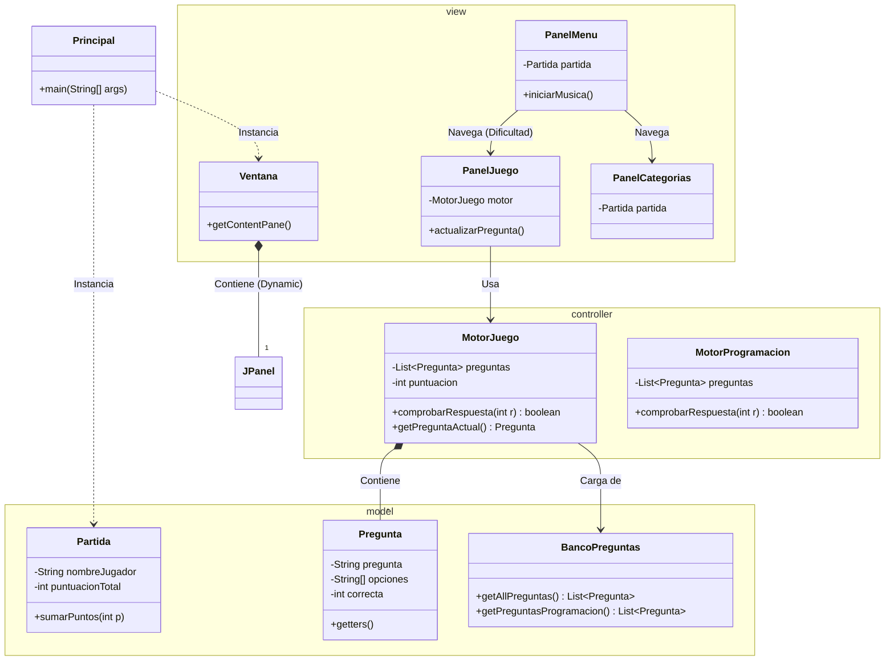

# TRIVIALDAW

## 🏗️ Arquitectura del Proyecto (Patrón MVC)

El juego está estructurado siguiendo el patrón **Modelo-Vista-Controlador (MVC)**, separando la lógica del juego de la interfaz gráfica para facilitar el mantenimiento y la expansión a nuevas asignaturas.




# TRIVIALDAW

## Arquitectura Inversa

El primer diagrama representaba una idea inicial del proyecto: pocas clases, relaciones simples y una estructura todavía sin definir. A medida que el desarrollo avanzó, el diseño evolucionó hacia algo más completo y realista.
Los principales cambios fueron:
- Más modularidad: se separó la lógica en MotorPregunta, MotorJuego y BancoPreguntas, evitando que un único controlador hiciera todo.
- Modelo ampliado: Partida y Pregunta crecieron para reflejar mejor las necesidades del juego.
- Vista más rica: aparecieron nuevos paneles (PanelAjustes, PanelCategorias, TutorialDialog), mostrando un flujo de navegación más complejo.
- Sistema de sonido: se añadió SoundManager, que no existía en el diseño inicial.
- Relaciones más precisas: el diagrama final muestra dependencias reales entre pantallas, controladores y modelo.
En resumen, el proyecto pasó de un boceto conceptual a un diseño completo, coherente con una aplicación funcional con menús, categorías, sonido y lógica de juego bien estructurada.


```

```mermaid
classDiagram
    direction LR

    class Partida {
        -String nombreJugador
        -int puntuacionTotal
        -boolean musicaActiva
        -boolean efectosActivos
        +Partida(String)
        +getNombreJugador() String
        +getPuntuacionTotal() int
        +sumarPuntos(int)
        +reiniciarPuntuacion()
        +isMusicaActiva() boolean
        +setMusicaActiva(boolean)
        +isEfectosActivos() boolean
        +setEfectosActivos(boolean)
    }

    class Pregunta {
        -String pregunta
        -String opcion1
        -String opcion2
        -String opcion3
        -String opcion4
        -int correcta
        +Pregunta(String,String,String,String,String,int)
        +getPregunta() String
        +getOpcion1() String
        +getOpcion2() String
        +getOpcion3() String
        +getOpcion4() String
        +getCorrecta() int
    }

    class BancoPreguntas {
        <<static>>
        -Map~String, List~Pregunta~~ banco
        +getPreguntasPorCategoria(String) List~Pregunta~
        +getAllPreguntas() List~Pregunta~
        +getPreguntasEntornos() List~Pregunta~
        +getPreguntasDigitalizacion() List~Pregunta~
        +getPreguntasLenguajeDeMarca() List~Pregunta~
        +getPreguntasProgramacion() List~Pregunta~
        +getPreguntasSistemas() List~Pregunta~
        +getPreguntasSostenibilidad() List~Pregunta~
    }

    class MotorPregunta {
        -ArrayList~Pregunta~ preguntas
        -int indice
        -int puntuacion
        +MotorPregunta(String)
        +getPreguntaActual() Pregunta
        +comprobarRespuesta(int) boolean
        +getPuntuacion() int
        +hayPreguntas() boolean
    }

    class MotorJuego {
        -MotorPregunta motorPregunta
        +MotorJuego(String)
        +MotorJuego(int)
        +getPreguntaActual() Pregunta
        +comprobarRespuesta(int) boolean
        +hayPreguntas() boolean
    }

    class Ventana {
        +Ventana()
    }

    class PanelMenu {
        -JButton botonJugar
        -JButton botonCategorias
        -JButton botonAjustes
        -Image fondo
        -Partida partida
        +PanelMenu(Partida)
    }

    class PanelCategorias {
        -Partida partida
        -Image fondo
        +PanelCategorias(Partida)
    }

    class PanelAjustes {
        -Partida partida
        -JCheckBox cbMusica
        -JCheckBox cbEfectos
        +PanelAjustes(Partida)
    }

    class PanelJuego {
        -JLabel preguntaLabel
        -JLabel puntuacionLabel
        -JButton boton1
        -JButton boton2
        -JButton boton3
        -JButton boton4
        -MotorJuego motor
        -Partida partida
        -Image fondo
        +PanelJuego(Partida,MotorJuego)
    }

    class TutorialDialog {
        +TutorialDialog(JFrame)
    }

    class Principal {
        +main(String[])
    }

    class SoundManager {
        <<singleton>>
        -boolean musicaActiva
        -boolean efectosActivos
        +getInstancia() SoundManager
        +reproducirMusica(String)
        +pararMusica()
        +reproducirEfecto(String)
        +setMusicaActiva(boolean,String)
        +setEfectosActivos(boolean)
    }

    BancoPreguntas --> Pregunta : contiene *
    MotorPregunta --> Pregunta : usa
    MotorJuego --> MotorPregunta : compone
    PanelJuego --> MotorJuego : usa
    PanelJuego --> Partida : usa
    PanelMenu --> Partida : usa
    PanelCategorias --> Partida : usa
    PanelAjustes --> Partida : usa
    Ventana --> PanelMenu : crea
    Principal --> Ventana : crea
    Principal --> Partida : crea
    PanelCategorias --> PanelJuego : crea
    PanelMenu --> PanelCategorias : crea
    PanelMenu --> PanelAjustes : crea
    PanelMenu --> PanelJuego : crea
    PanelJuego --> SoundManager : usa
    PanelMenu --> SoundManager : usa
    PanelCategorias --> SoundManager : usa
    PanelAjustes --> SoundManager : usa

```

