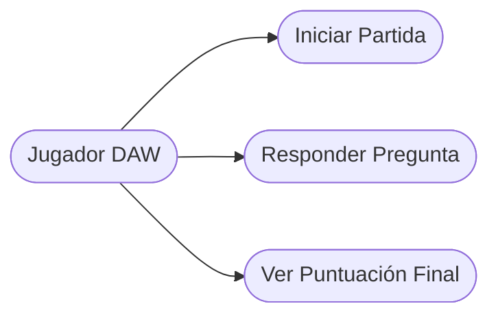

# Casos de Uso del Sistema

```mermaid
graph LR
    Jugador([Jugador DAW])
    
    %% Casos de uso
    Jugar([Iniciar Partida])
    Responder([Responder Pregunta])
    VerPuntos([Ver Puntuación Final])
    
    %% Relaciones
    Jugador --> Jugar
    Jugador --> Responder
    Jugador --> VerPuntos
```