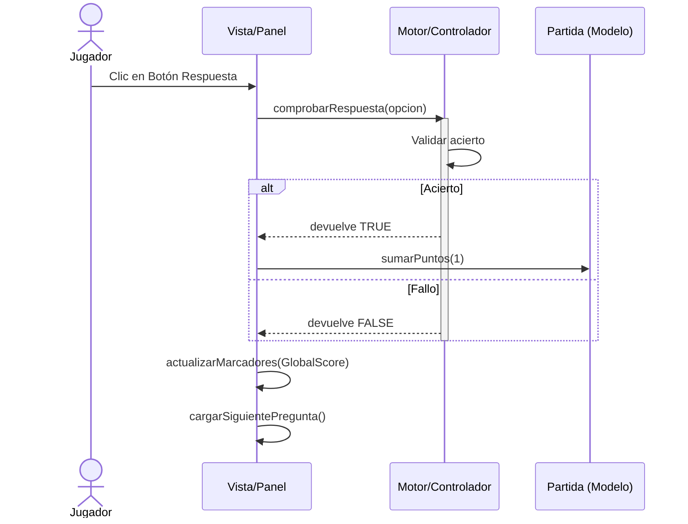

# Diagrama de Secuencia: Flujo de Respuesta

```mermaid
sequenceDiagram
    actor Jugador
    participant V as Vista/Panel
    participant M as Motor/Controlador
    participant P as Partida (Modelo)

    Jugador->>V: Clic en Botón Respuesta
    V->>M: comprobarRespuesta(opcion)
    
    activate M
    M->>M: Validar acierto
    
    alt Acierto
        M-->>V: devuelve TRUE
        V->>P: sumarPuntos(1)
    else Fallo
        M-->>V: devuelve FALSE
    end
    
    deactivate M
    
    V->>V: actualizarMarcadores(GlobalScore)
    V->>V: cargarSiguientePregunta()
```

```mermaid
sequenceDiagram
    actor Jugador
    participant V as Vista/Panel
    participant M as Motor/Controlador
    participant P as Partida (Modelo)

    Jugador->>V: Clic en Botón Respuesta
    V->>M: comprobarRespuesta(opcion)
    
    activate M
    M->>M: Validar acierto
    
    alt Acierto
        M-->>V: devuelve TRUE
        V->>P: sumarPuntos(1)
    else Fallo
        M-->>V: devuelve FALSE
    end
    
    deactivate M
    
    V->>V: actualizarMarcadores(GlobalScore)
    V->>V: cargarSiguientePregunta()

```

```mermaid
sequenceDiagram
    actor Jugador
    participant V as Vista/Panel
    participant M as Motor/Controlador
    participant P as Partida (Modelo)

    Jugador->>V: Clic en Botón Respuesta
    V->>M: comprobarRespuesta(opcion)
    
    activate M
    M->>M: Validar acierto
    
    alt Acierto
        M-->>V: devuelve TRUE
        V->>P: sumarPuntos(1)
    else Fallo
        M-->>V: devuelve FALSE
    end
    
    deactivate M
    
    V->>V: actualizarMarcadores(GlobalScore)
    V->>V: cargarSiguientePregunta()
```
    

```mermaid
sequenceDiagram
    actor Jugador
    participant V as Vista/Panel
    participant M as Motor/Controlador
    participant P as Partida (Modelo)

    Jugador->>V: Clic en Botón Respuesta
    V->>M: comprobarRespuesta(opcion)
    
    activate M
    M->>M: Validar acierto
    
    alt Acierto
        M-->>V: devuelve TRUE
        V->>P: sumarPuntos(1)
    else Fallo
        M-->>V: devuelve FALSE
    end
    
    deactivate M
    
    V->>V: actualizarMarcadores(GlobalScore)
    V->>V: cargarSiguientePregunta()
```   

```mermaid
sequenceDiagram
    actor Jugador
    participant V as Vista/Panel
    participant M as Motor/Controlador
    participant P as Partida (Modelo)

    Jugador->>V: Clic en Botón Respuesta
    V->>M: comprobarRespuesta(opcion)
    
    activate M
    M->>M: Validar acierto
    
    alt Acierto
        M-->>V: devuelve TRUE
        V->>P: sumarPuntos(1)
    else Fallo
        M-->>V: devuelve FALSE
    end
    
    deactivate M
    
    V->>V: actualizarMarcadores(GlobalScore)
    V->>V: cargarSiguientePregunta()
```

```mermaid
sequenceDiagram
    actor Jugador
    participant V as Vista/Panel
    participant M as Motor/Controlador
    participant P as Partida (Modelo)

    Jugador->>V: Clic en Botón Respuesta
    V->>M: comprobarRespuesta(opcion)
    
    activate M
    M->>M: Validar acierto
    
    alt Acierto
        M-->>V: devuelve TRUE
        V->>P: sumarPuntos(1)
    else Fallo
        M-->>V: devuelve FALSE
    end
    
    deactivate M
    
    V->>V: actualizarMarcadores(GlobalScore)
    V->>V: cargarSiguientePregunta()
```

```mermaid
sequenceDiagram
    actor Jugador
    participant V as Vista/Panel
    participant M as Motor/Controlador
    participant P as Partida (Modelo)

    Jugador->>V: Clic en Botón Respuesta
    V->>M: comprobarRespuesta(opcion)
    
    activate M
    M->>M: Validar acierto
    
    alt Acierto
        M-->>V: devuelve TRUE
        V->>P: sumarPuntos(1)
    else Fallo
        M-->>V: devuelve FALSE
    end
    
    deactivate M
    
    V->>V: actualizarMarcadores(GlobalScore)
    V->>V: cargarSiguientePregunta()
```

```mermaid
sequenceDiagram
    actor Jugador
    participant V as Vista/Panel
    participant M as Motor/Controlador
    participant P as Partida (Modelo)

    Jugador->>V: Clic en Botón Respuesta
    V->>M: comprobarRespuesta(opcion)
    
    activate M
    M->>M: Validar acierto
    
    alt Acierto
        M-->>V: devuelve TRUE
        V->>P: sumarPuntos(1)
    else Fallo
        M-->>V: devuelve FALSE
    end
    
    deactivate M
    
    V->>V: actualizarMarcadores(GlobalScore)
    V->>V: cargarSiguientePregunta()
```

```mermaid
sequenceDiagram
    actor Jugador
    participant V as Vista/Panel
    participant M as Motor/Controlador
    participant P as Partida (Modelo)

    Jugador->>V: Clic en Botón Respuesta
    V->>M: comprobarRespuesta(opcion)
    
    activate M
    M->>M: Validar acierto
    
    alt Acierto
        M-->>V: devuelve TRUE
        V->>P: sumarPuntos(1)
    else Fallo
        M-->>V: devuelve FALSE
    end
    
    deactivate M
    
    V->>V: actualizarMarcadores(GlobalScore)
    V->>V: cargarSiguientePregunta()
```

```mermaid
sequenceDiagram
    actor Jugador
    participant V as Vista/Panel
    participant M as Motor/Controlador
    participant P as Partida (Modelo)

    Jugador->>V: Clic en Botón Respuesta
    V->>M: comprobarRespuesta(opcion)
    
    activate M
    M->>M: Validar acierto
    
    alt Acierto
        M-->>V: devuelve TRUE
        V->>P: sumarPuntos(1)
    else Fallo
        M-->>V: devuelve FALSE
    end
    
    deactivate M
    
    V->>V: actualizarMarcadores(GlobalScore)
    V->>V: cargarSiguientePregunta()
```

```mermaid
sequenceDiagram
    actor Jugador
    participant V as Vista/Panel
    participant M as Motor/Controlador
    participant P as Partida (Modelo)

    Jugador->>V: Clic en Botón Respuesta
    V->>M: comprobarRespuesta(opcion)
    
    activate M
    M->>M: Validar acierto
    
    alt Acierto
        M-->>V: devuelve TRUE
        V->>P: sumarPuntos(1)
    else Fallo
        M-->>V: devuelve FALSE
    end
    
    deactivate M
    
    V->>V: actualizarMarcadores(GlobalScore)
    V->>V: cargarSiguientePregunta()
```

```mermaid
sequenceDiagram
    actor Jugador
    participant V as Vista/Panel
    participant M as Motor/Controlador
    participant P as Partida (Modelo)

    Jugador->>V: Clic en Botón Respuesta
    V->>M: comprobarRespuesta(opcion)
    
    activate M
    M->>M: Validar acierto
    
    alt Acierto
        M-->>V: devuelve TRUE
        V->>P: sumarPuntos(1)
    else Fallo
        M-->>V: devuelve FALSE
    end
    
    deactivate M
    
    V->>V: actualizarMarcadores(GlobalScore)
    V->>V: cargarSiguientePregunta()
```

```mermaid
sequenceDiagram
    actor Jugador
    participant V as Vista/Panel
    participant M as Motor/Controlador
    participant P as Partida (Modelo)

    Jugador->>V: Clic en Botón Respuesta
    V->>M: comprobarRespuesta(opcion)
    
    activate M
    M->>M: Validar acierto
    
    alt Acierto
        M-->>V: devuelve TRUE
        V->>P: sumarPuntos(1)
    else Fallo
        M-->>V: devuelve FALSE
    end
    
    deactivate M
    
    V->>V: actualizarMarcadores(GlobalScore)
    V->>V: cargarSiguientePregunta()
```
